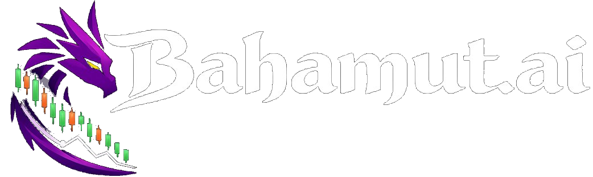

# Bahamut.AI — Institutional-Grade AI Trading Intelligence Platform



## What is Bahamut.AI?

Bahamut.AI is a self-learning AI trading platform that monitors **45 financial assets** (FX, crypto, stocks, commodities), runs **6 AI agents** that independently analyze markets, makes them debate each other, reaches weighted consensus, and tells users whether to buy, sell, or hold.

**Live:** [frontend-production-947b.up.railway.app](https://frontend-production-947b.up.railway.app)
**API:** [bahamut-production.up.railway.app](https://bahamut-production.up.railway.app)

---

## Architecture

### Infrastructure (Railway — 6 Services)

| Service | Type | Purpose |
|---------|------|---------|
| **bahamut** | FastAPI | REST API, serves all endpoints |
| **WORKER** | Celery Worker | Processes signal cycles, scans, paper trades |
| **BEAT** | Celery Beat | Scheduler — triggers periodic tasks |
| **FRONTEND** | Next.js 14 | React/TypeScript dashboard |
| **PostgreSQL** | Database | Users, cycles, paper trades, agent performance |
| **Redis** | Cache/Broker | Celery broker + result cache (30min TTL) |

### Tech Stack

- **Backend:** Python 3.12, FastAPI, SQLAlchemy (async+sync), Celery, Redis, PostgreSQL
- **Frontend:** Next.js 14, React 18, TypeScript, Tailwind CSS, TradingView Lightweight Charts
- **AI:** Google Gemini 2.0 Flash (sentiment, daily briefs), 6 custom scoring agents
- **Data:** Twelve Data Grow plan (unlimited daily, 55 req/min), Finnhub (news + calendar)

---

## 45 Monitored Assets

| Class | Assets | Count |
|-------|--------|-------|
| **FX** | EUR/USD, GBP/USD, USD/JPY, AUD/USD, USD/CHF, USD/CAD, NZD/USD, EUR/GBP | 8 |
| **Crypto** | BTC, ETH, SOL, BNB, XRP, ADA, DOGE, AVAX, DOT, LINK | 10 |
| **Stocks** | AAPL, MSFT, GOOGL, AMZN, NVDA, META, TSLA, JPM, V, UNH, MA, HD, PG, JNJ, AMD, CRM, NFLX, ADBE, INTC, PYPL, UBER, SQ, SHOP, PLTR, COIN | 25 |
| **Commodities** | Gold (XAU/USD), Silver (XAG/USD) | 2 |

---

## 6 AI Agents

| Agent | Role | What It Analyzes |
|-------|------|-----------------|
| **Technical** | Chart reader | RSI, MACD, EMA alignment (20/50/200), ADX, Stochastic |
| **Macro** | Economist | Yield curve, DXY, VIX, EMA200 structure |
| **Sentiment** | News reader | Gemini reads real Finnhub headlines, scores bullish/bearish |
| **Volatility** | Risk measurer | Bollinger Bands, realized vol, ATR, BB position |
| **Liquidity / Whales** | Money tracker | Volume spikes (whale detection), EMA structure, sweep detection |
| **Risk** | Guardian | Drawdown limits, correlation, VETO power |

### Consensus Formula
```
FinalScore = SUM(Wi x Ci x Ti x Ri) / SUM(Wi x Ti x Ri)
```
Where: W=base weight, C=confidence, T=trust score, R=regime relevance

### Decision Thresholds (BALANCED profile)
- **STRONG_SIGNAL:** score >= 0.72 (AUTO execute)
- **SIGNAL:** score >= 0.58 (APPROVAL required)
- **WEAK_SIGNAL:** score >= 0.45 (WATCH only)
- **NO_TRADE:** below 0.45

---

## Market Scanner

Every 30 minutes, the scanner:
1. Quick-scans all 45 assets (60 candles each, RSI/EMA/MACD/ADX/BB/Stochastic scoring)
2. Whale detection (volume vs 20-period avg: 2x=+15, 3x=+22, 5x=+30 bonus)
3. Deep analysis on top 10 picks (full 6-agent cycle)
4. Results cached in Redis, displayed on Top Picks page with countdown timer

---

## Self-Learning Paper Trading Engine

Trades with $100,000 demo money automatically:

1. Signal fires (consensus >= 0.58) -> paper trade opens
2. ATR-based SL (2x) and TP (3x), 2% risk per trade, max 5 positions
3. Positions checked every 60s for SL/TP/timeout (48h max)
4. On close -> each agent graded: correct +0.015 trust, wrong -0.025 trust (asymmetric)
5. Trust scores feed back into consensus weights
6. System gets smarter every day

---

## Whale Detection

| Method | Source | Detection |
|--------|--------|-----------|
| Volume Spikes | Candle data | Current vs 20-period avg (EXTREME/MAJOR/SPIKE) |
| Insider Transactions | Finnhub | CEO/CFO buys/sells for stocks |
| Whale Alert | API | Large crypto transfers to/from exchanges |

---

## Frontend Pages

| Page | Route | Purpose |
|------|-------|---------|
| Command | `/` | Dashboard: signals, risk, news feed, consensus, daily brief |
| Top Picks | `/top-picks` | Scanner ranked results + countdown + clickable reasons |
| Macro Arena | `/macro-arena` | Multi-asset overview with charts |
| Event Radar | `/event-radar` | Economic calendar + real-time news |
| Agent Council | `/agent-council` | TradingView chart + trigger cycles + agent outputs |
| Execution | `/execution` | Trade approval: approve/reject/snooze |
| Risk Control | `/risk-control` | Drawdown meters, circuit breakers, kill switch |
| Trade Journal | `/journal` | Paper trades + signal cycle history |
| Self-Learning | `/paper-trading` | Portfolio, agent leaderboard, learning log |
| Learning Lab | `/learning-lab` | Strategy fitness, trust scores |
| Intel Reports | `/intel-reports` | AI daily brief (Gemini-generated) |
| Landing | `/landing` | Marketing page (black+gold, animated) |

All pages are mobile responsive with hamburger menu sidebar.

---

## Celery Beat Schedule

| Task | Interval | Purpose |
|------|----------|---------|
| OHLCV/Features | 2 min | Fetch candles + compute indicators |
| Breaking news | 2 min | Scan for market-moving headlines |
| Signal cycles | 15 min | Full 6-agent analysis (FX/Crypto) |
| Stock cycles | 30 min | US market hours only |
| Market scanner | 30 min | Scan all 45 assets + deep analyze top 10 |
| Position check | 1 min | Paper trading SL/TP/timeout |
| Daily brief | 06:00 UTC | AI morning market brief |
| Daily report | 22:00 UTC | Paper trading performance summary |

---

## Environment Variables

| Variable | Purpose |
|----------|---------|
| `DATABASE_URL` | PostgreSQL connection |
| `REDIS_URL` | Redis connection |
| `TWELVE_DATA_KEY` | Market data (Grow plan) |
| `FINNHUB_KEY` | News + economic calendar |
| `GEMINI_API_KEY` | Sentiment analysis + daily briefs |
| `JWT_SECRET` | Auth token signing |
| `ANTHROPIC_API_KEY` | Claude API (fallback) |

---

## Pricing

| Plan | Price | Assets | Features |
|------|-------|--------|----------|
| Starter | $49/mo | 4 FX + Gold | 6 agents, basic alerts, journal |
| Pro | $149/mo | All 45 | All timeframes, scanner, news, AI brief |
| Institutional | $499/mo | Unlimited | API, multi-user, custom weights |

14-day free trial on all plans.

---

## What's Next

- [ ] Telegram/Email alerts on STRONG_SIGNAL
- [ ] Alpaca integration (stocks + crypto execution)
- [ ] OANDA integration (FX execution)
- [ ] Custom domain (bahamut.ai)
- [ ] Stripe billing
- [ ] Demo mode (no-login preview)
- [ ] WebSocket live updates
- [ ] Backtest framework

---

*Built by Chris Giannakkas | 2026 Bahamut.AI*
